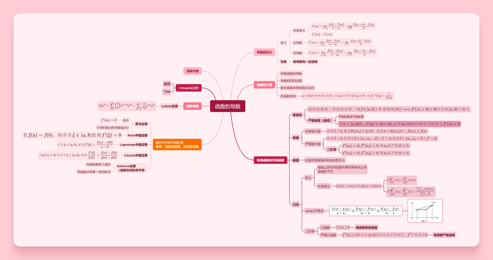
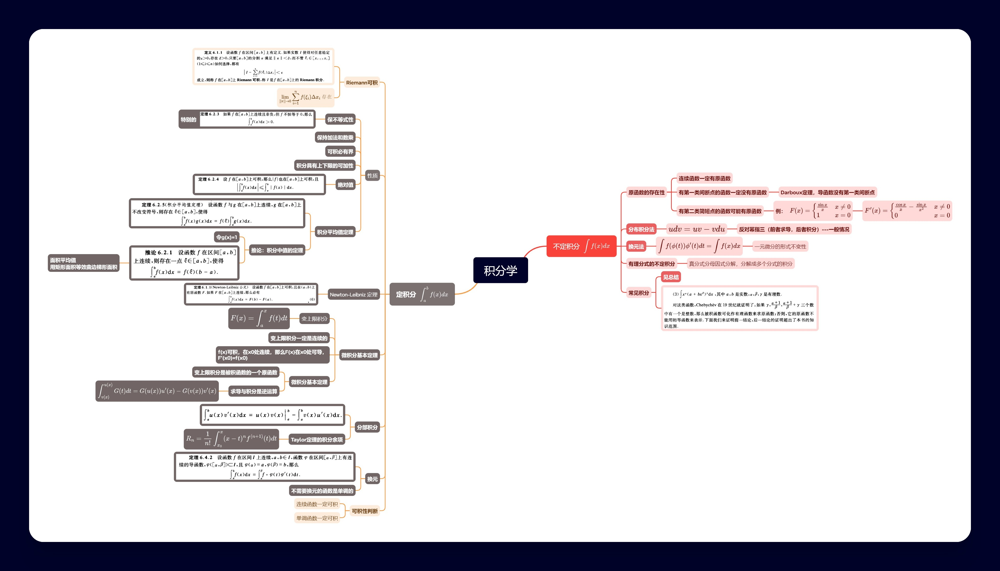

## 数学分析之数列的极限

### 1补充要点

#### 1.证明数列极限的方法

1.定义：($\epsilon - N\space$ 语言)
2.夹逼原理
3.Cauchy收敛
4.单调有界定理
5.子列收敛(所有的数列 or 奇偶数列 等)
6.Stolz定理：
7.计算法：$\color{Red}一般要求每个参与计算的数列要有极限，要注意别忘了$
8.上下极限相同
9.函数极限 + 归结原理

## 函数的连续性

### 2补充要点

#### 证明函数的极限

1.定义 ($\epsilon - \delta \space $ 语言)
2.归结原理 (用于证明没有极限比较好)
3.函数的连续性(极限等于函数值)
4.等价无穷小(可理解为Taylor展开取一部分)

$\color{pink}适用于乘除式的替换，加减一般用Taylor展开$

$
\begin{aligned}
常见等价无穷小:\\\\
&1.(1+x)^\alpha-1 \sim \alpha x \\\\
&2.ln(x+1) \sim x \\\\
\end{aligned}
$
5.夹逼原理
6.计算法(eg.取e为底数的指数)
7.Cauchy 收敛
8.Taylor 展开:

$$
\begin{aligned}
常见Taylor展开： \\\\
&1.e^x = 1 + x + \frac{x^2}{2!} + \frac{x^3}{3!} + o(x^3)  \\\\
&2.\ln(1+x) = x - \frac{x^2}{2} + \frac{x^3}{3} + o(x^3)  \\\\
&3.\frac{1}{1-x} = 1 + x + x^2 + x^3 + o(x^3)  \\\\
&4.(1+x)^\alpha = 1 + \alpha x + \frac{\alpha (\alpha-1)}{2!}x^2 + \cdots + \frac{\alpha(\alpha-1)\cdots(\alpha-n+1)}{n!}x^n + o(x^n)  \\\\
\end{aligned}
$$

## 函数的导数

(----:blush::v:----)

## Taylor定理

## 积分学

## 总结

### 不等式总结

1.**Wallis公式**  (据说很重要，要记)
定义**双阶乘**：隔数跳跃乘
$$
I_n=\int^{\frac \pi2}_0 \sin^m xdx \cos^n xdx =
\begin{cases}
\frac {(m-1)!!(n-1)!!}{(m+n)!!}\cdot \frac\pi2, & 当m,n都是偶数时 \\\\
\frac {(m-1)!!(n-1)!!}{(m+n)!!}, &否则
\end{cases}
$$

tmd 这个代码我鼓捣了将近一个小时一直那`\left \{`语法，始终渲染不对，知道发现了`\begin{cases}` 生气了:anger::anger::rage::rage:,影响我学习:fire::rage::fire:,在此记录--12月11日
