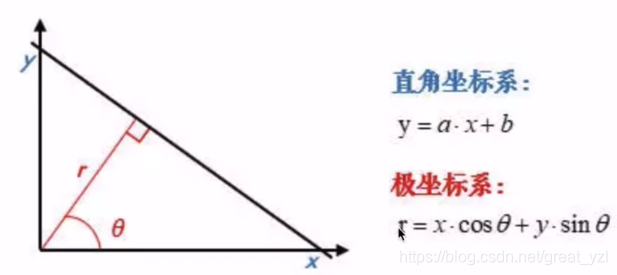
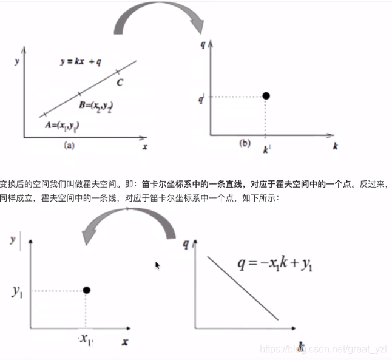
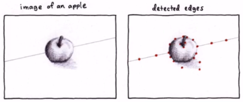
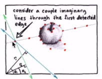
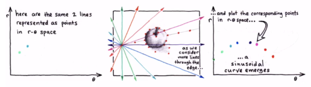
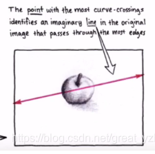
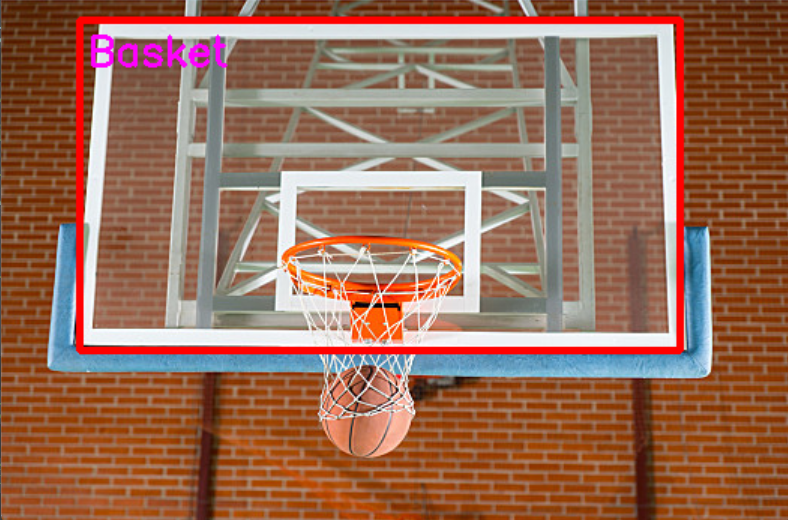

## 理论

### 定义

**霍夫变换**(Hough Transform)是图像处理中的一种特征提取技术，它通过一种**投票算法**检测具有特定形状的物体。Hough变换是图像处理中从图像中识别几何形状的基本方法之一。

原则上霍夫变换可以检测任何形状，但复杂的形状需要的参数就多，霍夫空间的维数就多，因此在程序实现上所需的内存空间以及运行效率上都不利于把标准霍夫变换应用于实际复杂图形的检测中。**霍夫梯度法**是霍夫变换的改进（圆检测），它的目的是减小霍夫空间的维度，提高效率。

### 原理

#### 1.直线检测

* **将要检测的对象转到霍夫空间中，利用累加器找到最优解，即为所求直线。**

$\color{CadetBlue} {(检测前对图像进行二值化处理}$

##### 霍夫空间

霍夫空间是一种“极坐标”空间（不同于一般意义的极坐标）

而霍夫变换就是将笛卡尔坐标系转化成霍夫空间。



**转换**：
$$1. \space \space y=kx+q \space \space(x-y笛卡尔空间)\Rightarrow q=-kx+y \space \space(k-q霍夫空间)$$
$$2. \space \space x\cos\theta+y\sin\theta=\rho \space \space (x-y笛卡尔空间)\Rightarrow \rho=x\cos\theta+y\sin\theta \space \space (\theta-\rho 霍夫空间)$$

因此：
1.点(笛卡尔空间)$\space \Rightarrow \space$三角函数曲线 或 直线(**Hough Space**)(式子不同结果不同，**一般选择三角函数**)


2.直线(笛卡尔空间) $\Longleftrightarrow$点(**Hough Space**) **(为两个点对应的曲线交点，两点确定一条直线)**

3.直线(**Hough Space**)$\space \Rightarrow \space$点(笛卡尔空间)


##### 具体过程

1.首先边缘检测，得到许多点。



2.遍历第一个点的各个 $\theta$ 方向的 $\rho$ ,得到这个点对 应的正弦曲线。


--输入二值化的图像中的每个边缘点的坐标（x，y），通过霍夫变换得到多个矢量（$\rho,\theta$）（**这所有矢量在霍夫空间中表示曲线**）（$\rho$ 是直线到图像左上角（笛卡尔坐标系原点）的距离，$\theta$ 是直线从竖直状态旋转的角度）<目前都是对同一个点>

3.遍历每一个点，得到多条曲线。

--首先构建一个矢量结构变量来代表一个累加器，每个累加器都会对应于前一步得到的每个霍夫空间中的点（$\rho_{0},\theta_{0}$ ）,这个累加器会用来记录经过这个点的曲线数目


--投票：遍历图像中的每个点，将其对应的（$\rho,\theta$）曲线在累加器数组中进行投票，每存在一条经过累加器数组所对应的点，就对累加器数组的元素加1

4.多条曲线相较于一点，这个点在笛卡尔空间对应的直线的就是原图中的直线。

--最终检测，若最终累加器数组中的值大于已经设定的阈值，则认为该点对应的直线为待检测直线。



##### 变换代码

###### 标准霍夫变换函数

``` C++
void HoughLines(InputArray image, OutputArray lines, double rho, double theta, int threshold, double srn=0, double stn=0 )  
```

**其中：
输入的图像是 **灰度图(最好二值化处理)**
输出的是直线数据 **(为矢量数据 向量空间中的点($\rho ,\theta$) )**
rho 变量指的是长度步长(单位：像素)。为 **double**  (双精度浮点数)
theta 变量指的是角度步长(单位：弧度)。为 **double**
int类型的threshold，累加平面的阈值参数**
后两个变量先选择忽略，默认为0

###### 渐进概率式霍夫变换

```C++
HoughllLinesP(InputArrayimage, OutputArray lines, double rho, double theta, int threshold, minLineLength =, void cv=HoughllLinesP( InputArrayimage, OutputArray lines.double 0, double maxLineGap = 0)

```

image:待检测直线的原图像，必须是CV_8C的单通道二值图像。
lines:霍夫变换检测到的直线输出量，每一条直线都由4个参数进行描述，分别是直线两个端点的坐标rho:以像素为单位的距离分辨率。
theta:以弧度为单位的角度分辨率。
threshold:累加器的阈值。
minLineLength:直线的最小长度，当检测直线的长度小于该数值时将会被剔除。
maxLineGap:允许将同一行两个点连接起来的最大距离。

##### 例子1（识别篮板_1）

**待识别图像**


``` C++
#include <opencv2/opencv.hpp>
#include <iostream>
using namespace std;
using namespace cv;

int main() {
    // 读取图像
    Mat image,image1 ,image2;
    image = imread("Pictures/basket_2.png", cv::IMREAD_COLOR); // 将 "path_to_your_image.jpg" 替换为您的图像路径
    image1 = imread("Pictures/basket_2.png", cv::IMREAD_COLOR);
    image2 = imread("Pictures/basket_2.png", cv::IMREAD_COLOR);
    // 检查图像是否成功读取
    if (image.empty()) {
        cerr << "Could not read the image." << endl;
        return 1;
    }
    //二值化
    Mat gray, edges;
    cvtColor(image, gray, COLOR_BGR2GRAY);

    threshold(gray, edges, 220, 255, THRESH_BINARY);
    //开运算
    Mat element = getStructuringElement(MORPH_RECT, Size(3, 3));
    ////imshow("edges", edges);
    morphologyEx(edges, edges, MORPH_OPEN, element);
    
    /////imshow("element", edges);
    //霍夫变换HoughlinesP
    vector<Vec4i> lines;
    HoughLinesP(edges, lines, 1, CV_PI/180, 50, 60, 50);
    for (size_t i = 0; i < lines.size(); i++) {
        Vec4i l = lines[i];
        line(image, Point(l[0], l[1]), Point(l[2], l[3]), Scalar(0, 0, 255), 2, LINE_AA);
        //是 OpenCV 中用于绘制抗锯齿线条的标志。抗锯齿（Anti-Aliasing）是一种技术，用于使线条和边缘看起来更加平滑，减少锯齿状的边缘效果。
    }
    ////imshow("Hough Lines", image);

    //创建掩码提取红色
    Mat mask;
    inRange(image, Scalar(0, 0, 200), Scalar(100, 100, 255), mask);
    ////imshow("mask", mask);
    //轮廓提取
    vector<vector<Point>> contours;
    vector<Vec4i> hierarchy;
    findContours(mask, contours, hierarchy, RETR_TREE, CHAIN_APPROX_SIMPLE);
    //绘制面积最大的闭合轮廓
    double maxArea = 0;
    int maxAreaIdx = 0;
    for (size_t i = 0; i < contours.size(); i++) {
        double area = contourArea(contours[i]);
        if (area > maxArea) {
            maxArea = area;
            maxAreaIdx = i;
        }
    }
    drawContours(image1, contours, maxAreaIdx, Scalar(0, 255, 0), 3);
    ////imshow("contours", image1);
    //显示方框并写名称
    Rect box = boundingRect(contours[maxAreaIdx]);
    rectangle(image2, box, Scalar(0, 0, 255), 3);
    putText(image2, "Basket", Point(box.x +5, box.y +30), FONT_HERSHEY_SIMPLEX, 0.9, Scalar(255, 0, 255), 2);
    //显示图像
    imshow("bounding box", image2);
    waitKey(0);
    destroyAllWindows();
    //输出面积大小
    cout << "Area: " << maxArea << endl;
    return 0;
    
}
```

**输出结果：**


##### 例子2 （识别篮板2.0---视频）

反正也是屎山，就这吧  :unamused:

``` C++
#include <iostream>
#include <opencv2/opencv.hpp>
using namespace std;
using namespace cv;

// 计算三点之间的角度
double angle(Point pt1, Point pt2, Point pt0) {
    double dx1 = pt1.x - pt0.x;
    double dy1 = pt1.y - pt0.y;
    double dx2 = pt2.x - pt0.x;
    double dy2 = pt2.y - pt0.y;
    return (dx1 * dx2 + dy1 * dy2) / sqrt((dx1 * dx1 + dy1 * dy1) * (dx2 * dx2 + dy2 * dy2));
}
//读取视频
int main() {
    VideoCapture cap;
    cap.open("Videos/basket.mp4");
    if (!cap.isOpened()) {
        cerr << "Error! Unable to open camera or video" << endl;
        return -1;
    }
    while (1) {
        Mat frame;
        cap >> frame;
        if (frame.empty()) {

            break;
        }
        
        Mat frame_1 = frame.clone();

        Mat gray, binary;
        //转换为灰度图
        cvtColor(frame, gray, COLOR_BGR2GRAY);
        //二值化
        threshold(gray, binary, 190, 255, THRESH_BINARY); 
        //开运算
        Mat element = getStructuringElement(MORPH_RECT, Size(15, 15));
        morphologyEx(binary, binary, MORPH_OPEN, element);
        //霍夫变换
        vector<Vec4i> lines;
        HoughLinesP(binary, lines, 1, CV_PI / 180, 100, 50, 40);
        for (size_t i = 0; i < lines.size(); i++) {
            Vec4i l = lines[i];
            line(frame, Point(l[0], l[1]), Point(l[2], l[3]), Scalar(0, 0, 255), 2, LINE_AA);
        }
        //获取红色掩码
        Mat mask;
        inRange(frame, Scalar(0, 0, 200), Scalar(100, 100, 255), mask);
        //再次开运算
        morphologyEx(mask, mask, MORPH_OPEN, element);
        //对掩码再做霍夫变换
        vector<Vec4i> mask_lines;
        HoughLinesP(mask, mask_lines, 1, CV_PI / 180, 100, 50, 120);
        for (size_t i = 0; i < mask_lines.size(); i++) {
            Vec4i l = mask_lines[i];
            line(mask, Point(l[0], l[1]), Point(l[2], l[3]), Scalar(255, 0, 0), 2, LINE_AA);
        }
        
        //查找轮廓
        vector<vector<Point>> contours;
        vector<Vec4i> hierarchy;
        findContours(mask, contours, hierarchy, RETR_TREE, CHAIN_APPROX_SIMPLE);
        
        double maxArea = 0;
        int maxAreaIndex = -1;
        for (size_t i = 0; i < contours.size(); i++) {
            double area = contourArea(contours[i]);
            Rect boundingRect = minAreaRect(contours[i]).boundingRect();
            double rectArea = boundingRect.width * boundingRect.height;
            double areaRatio = area / rectArea;
            // 筛去轮廓面积小于1500和轮廓面积与矩形面积相差过大的轮廓
            if (area > maxArea && area > 6000 && areaRatio > 0.83 && areaRatio < 1.2) {
                maxArea = area;
                maxAreaIndex = i;
            }
        }
        if (maxAreaIndex != -1) {
            Rect boundingRect = minAreaRect(contours[maxAreaIndex]).boundingRect();
            drawContours(frame_1, contours, maxAreaIndex, Scalar(0, 255, 255), 3, LINE_8, hierarchy, 0);
            rectangle(frame_1, boundingRect.tl(), boundingRect.br(), Scalar(0, 255, 0), 2);
            putText(frame_1, "basket", boundingRect.tl(), FONT_HERSHEY_SIMPLEX, 0.8, Scalar(255, 0, 0), 2);
            // 输出最终轮廓面积大小
            cout << "Final contour area: " << maxArea << endl;
        }
        
        imshow("Frame", frame_1);
        if (waitKey(10) == 27) {
            break;
        }
    }
    cap.release();
    destroyAllWindows();
    return 0;
}

```

现在代码没完全搞清楚，随后好好复盘一下。 :blush:

**!!** 这里发现wsl(不知道是不是只有wsl有这种情况) 对ffmpeg好像不一定会默认下载好，这会导致视频无法读取，在这里报错break出来 $\Downarrow$

``` C++
if (!isopen()){
    cerr <<"error"
    break
}
```

所以需要下载ffmpeg并且启动，可以用`ffplay Videos/q.mp4`在`terminal`里来检验ffmpeg是否能够正常使用，正常会有输出结果。

之后ffmpeg好像还得和Opencv库一样写在**CMakeLists.txt**文件里，再`cmake`一下。
